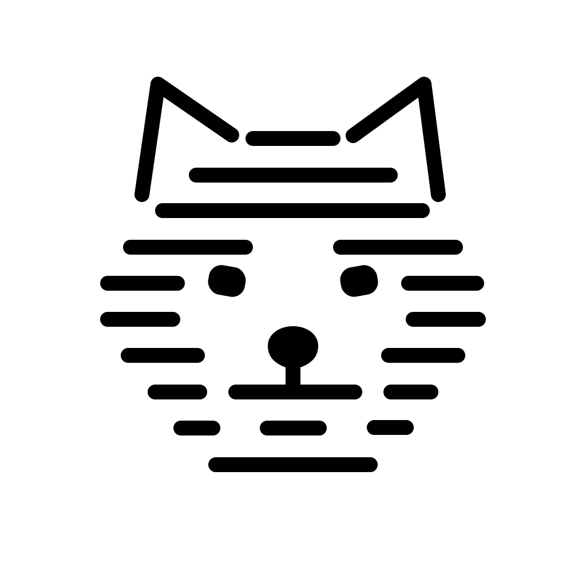

# WoofWare.LiangHyphenation

<picture>
  <source media="(prefers-color-scheme: dark)" srcset="logos/dark.svg">
  <source media="(prefers-color-scheme: light)" srcset="logos/light.svg">
  
</picture>

The Liang hyphenation algorithm.

Status: unimplemented.

# Licence

WoofWare.LiangHyphenation is licenced to you under the MIT licence; see [LICENSE.md](./LICENSE.md).
